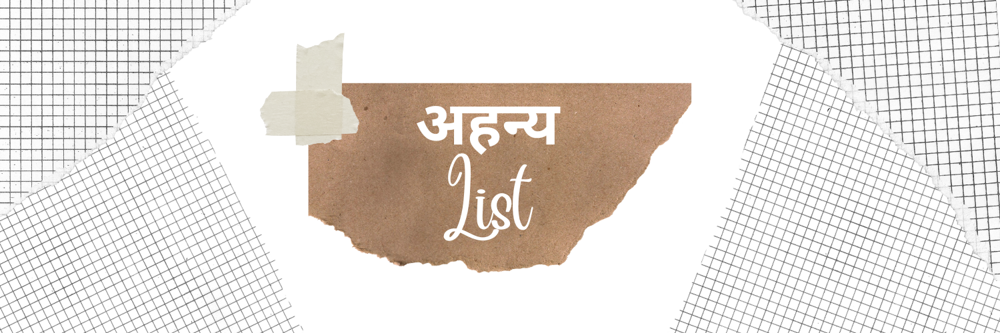

<h1>🔂 अहन्य - A browser extension on a daily basis</h1>
    
    
It eliminates the agony of utilizing many tools to track the productivity at different times while we've something that you can use in a site every day, and effortlessly integrates it into your browser.

 

## Specifications

### ✨ Supported features:

- [x] Note board
- [x] Bookmarks
- [ ] Todo list

### 🌐 Supported browsers:

- [x] Google Chrome
- [ ] Firefox
- [ ] Brave
- [ ] Chromium
- [ ] Microsoft Edge
- [ ] Safari

### Availability:

- [x] Extension
- [x] Web App

 

## ⚡️ Contribution Guidelines

**Don't forget to give a star ⭐ It'll reflects your support to the project.**

Wanna contribute to our project, but don't know how to start? Check out our [**contributing guidelines**](https://github.com/devstrons/ahanya/blob/main/CONTRIBUTING.md) for how to make your first contribution here.

 

## 🛠 Building

- `Go Live 'at bottom of Visual Studio Code'` — It run the website locally in your browser (PORT: http://localhost:5500)

 

## 📰 License

> The **ahanya - अहन्य** tool is released under the [MIT license](https://github.com/devstrons/ahanya/blob/main/LICENSE).   Developed &amp; maintained by the DEVSTRONS' Community. Copyright 2023 © DEVSTRONS.

> **YouTube** <a href="https://www.youtube.com/devstrons" target="_blank" rel="noopener">@devstrons</a> &nbsp;&middot;&nbsp; 
> **Instagram** <a href="https://www.instagram.com/devstrons" target="_blank" rel="noopener">@devstrons</a> &nbsp;&middot;&nbsp; 
> **Discord** <a href="https://discord.com/invite/MVujzTBqed" target="_blank" rel="noopener">DEVSTRONS'</a> &nbsp;&middot;&nbsp; 
> **Twitter** <a href="https://twitter.com/devstrons" target="_blank" rel="noopener">@devstrons</a>
